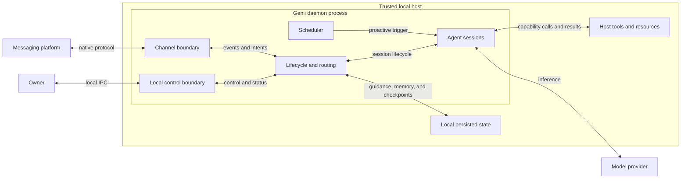

# Genii Architecture

Genii is a local-first runtime for a persistent AI companion. A single long-lived daemon owns agent execution,
conversation routing, messaging connections, scheduled work, and persisted local state. Model providers and messaging
platforms are external services; the authoritative copy of the companion's operating context and continuity is held
on the user's machine.

This document describes the system's conceptual organization and current architectural constraints. It intentionally
avoids implementation and repository structure.

## Architectural shape

Genii separates owner control from conversation traffic while keeping both behind one authoritative local process.

The daemon is both the control plane and the conversation plane:

- The **control plane** lets local clients configure and inspect the system, manage channels and sessions, trigger
  scheduled work, and observe status.
- The **conversation plane** receives external events, selects the appropriate session, runs the agent, and returns
  platform-appropriate responses.

Agent sessions are concurrent logical state machines inside the daemon. They are not separate services, containers,
or operating-system processes.

Control-plane observations use connection-owned subscriptions. Agent output and structured daemon logs are retained in
bounded, in-memory journals so a client can replay recent records and then follow new records on the same subscription.
The daemon installs the live subscription before taking the replay snapshot; sequence numbers let clients merge the
intentional overlap without duplicates or a replay-to-live gap. Closing a local IPC connection releases only that
connection's subscriptions. The journals are operational buffers rather than durable state and reset with the daemon.

## Core concepts

| Concept | Architectural meaning |
| --- | --- |
| **Channel** | One configured connection to a messaging platform. It owns platform authentication, ingress filtering, addressing, and presentation behavior. |
| **Destination** | An opaque address within a channel, such as a chat, thread, topic, or direct-message context. Platform-specific addressing does not leak into agent reasoning. |
| **Conversation** | The continuity scope at one channel-specific destination. A persisted binding assigns at most one agent session to that scope, so it is not a global identity for a person. |
| **Agent session** | The stable execution identity and history for reactive or proactive work. A conversation may bind one; a session may finish a turn and later resume. |
| **Guidance** | Owner-authored context defining identity, behavior, task recipes, skills, time context, and proactive-work policy. |
| **Memory** | Owner- and agent-maintained learned or working context that is retained across otherwise independent sessions. |
| **Checkpoint** | A versioned, provider-neutral record of session history and metadata. It also records an active tool-call batch as per-call durable state, including completed steps, exact waits, accepted resolutions, and completed results, so partially completed parallel work can recover after restart. |
| **Pulse** | An optional scheduled session for proactive work. It shares normal guidance and capabilities but is independent of any reactive conversation session. |

The current external messaging integration is Telegram. The channel contract is intentionally platform-neutral so
additional integrations can preserve the same routing and session semantics.

## Execution flows

### Reactive conversations

1. A channel authenticates and filters an external update, then converts it into a normalized event with an opaque
   origin destination.
2. The daemon handles in-channel commands directly or converts conversational events into agent input.
3. Events for one destination are routed in arrival order, while independent destinations may proceed concurrently.
   The destination's conversation binding then selects a session.
4. If no session is bound, Genii creates and binds one before execution starts. A live session receives follow-up
   input directly. A completed or post-restart session resumes from its checkpoint. Ordinary input is rejected with
   an explicit response while the bound session has a durable tool wait.
5. The agent combines its history, current guidance, selected model, and available tools to execute the turn. Tool
   calls emitted together may run concurrently, but their results retain the assistant message's source order.
6. Status, tool activity, streamed output, final responses, and errors become semantic outbound intents. The channel
   decides how those intents appear on its platform.
7. The binding remains after the turn so later messages retain continuity. Starting over explicitly replaces the
   bound session for that destination.

Binding before execution is an important invariant: even the earliest agent output always has a destination.
Per-destination routing order is another: restart recovery, binding changes, and subsequent input cannot fork the
same conversation into overlapping session mutations.

### Proactive work

When enabled, the scheduler creates a fresh pulse session using the same guidance, model selection, and tools as a
normal session. A pulse can deliver useful output to a named destination or the most recently active destination, or
it can run silently. Selecting the most recent destination affects delivery only; it does not attach the pulse to that
conversation's history. A pulse may also explicitly report that no action is warranted, in which case no message is
sent.

## State and continuity

Continuity is split into layers with different responsibilities:

- **Conversation bindings** preserve where replies belong and which session should handle the next message.
- **Session checkpoints** preserve completed-turn history and session metadata across later turns and daemon restarts.
  During a durable tool-call batch, they additionally preserve independent state for each call under its stable
  tool-call identity: input, completed steps, exact wait, deadline, accepted resolution, and any completed result.
  This lets recovery reuse finished siblings and replay only unfinished invocations without a synthetic user turn.
- **Guidance** preserves the owner-authored identity, policies, and reusable capabilities applied to sessions.
- **Memory** preserves learned context and working state across otherwise independent sessions.

Recovery is lazy. On startup, Genii restores persisted routing state but does not eagerly resume every prior session.
New input resumes a completed bound session from its checkpoint. A dormant wait remains dormant until the control
plane inspects or resolves it; inspection does not instantiate the model. If the last checkpoint instead records a
committed batch whose model continuation is pending, routing recovers that continuation before processing the new
input as a separate turn. If the recovered continuation reaches a new durable wait, that wait replaces the completed
batch marker and remains bound to the conversation; the triggering input is not added to history and receives the
ordinary waiting response. If no usable checkpoint exists, the daemon starts a fresh session and repairs the binding.

Completed turns are checkpointed, and durable tool lifecycle transitions add stricter barriers: a wait is persisted
before it is published, an accepted resolution is persisted before it is acknowledged, and completed results are
persisted before model execution continues. Lifecycle mutations and checkpoint writes are serialized within each
session so concurrent calls cannot overwrite one another or let an older snapshot replace a newer state. Checkpoint
files and conversation bindings use atomic replacement, and binding changes are persisted when they occur.

The persistence model names both deferred recovery boundaries. A batch-pending checkpoint means the durable tool
batch still has unfinished calls, including the case where a suspended call has completed but an ordinary sibling has
not. A continuation-pending checkpoint means every per-call result is committed in source order and one model
continuation remains. These records stay durable until a subsequent checkpoint records that model turn, so recovery
can finish a partial batch or issue one continuation without replaying completed tools. Provider inference itself is
at-least-once if a process fails after the provider accepts that request but before the following checkpoint commits.
A recovered continuation may itself begin another durable batch; reaching its fully parked boundary returns recovery
control to the daemon while retaining the warm session for later resolution.

A suspension parks inside the affected tool invocation. Sibling calls can keep running, while the model runtime's
batch barrier prevents the next inference step until every call has a result. Calls and waits are tracked separately
by stable tool-call identity, and each wait has an opaque identity for the exact suspended step. Completed results are
assembled in assistant source order rather than completion order. Recovery applies the same ordering, resumes all
unfinished siblings, and issues one model continuation in each successful recovery attempt after the batch completes.

Runtime ownership begins when a registered Genii tool wrapper starts, but recoverable batch durability begins only
when the first wait checkpoint commits. Provider or model-runtime validation before wrapper entry remains outside the
replay model; once a sibling commits that first wait, already-finalized preflight result artifacts are retained so the
recoverable batch stays complete and source ordered. Sibling work completed before that wait is otherwise outside the
durable model. Within a durable batch, arbitrary code between later barriers can still replay after an abrupt process
failure; side effects that must not repeat belong in stable, memoized tool steps. Delivery, provider inference, and
arbitrary post-resume side effects remain at-least-once rather than exactly-once. These stores favor inspectable,
local state over distributed coordination or high availability.

Durable waits are resolved explicitly through the control plane. Multiple sibling invocations may suspend in one
batch, and one invocation may encounter sequential waits. Targeted cancellation affects only its exact suspension;
aborting the session stops the whole batch. See [Durable suspensions](docs/durable-suspensions.md) for the tool and RPC
contracts.

Configuration is also local and owner-managed. Logical model names separate session policy from provider-specific
identifiers, and secret references keep credentials out of ordinary configuration. Native credential storage is
preferred, with a restricted local file as a fallback. Configuration is read at daemon startup; restarting the daemon
is currently the reliable way to apply changes.

## Boundaries and extension model

Genii isolates change at explicit architectural boundaries:

- **Messaging boundary:** platform adapters translate between native updates and normalized inbound events, then
  interpret semantic outbound intents using platform capabilities.
- **Model boundary:** model adapters translate common session semantics to a configured inference provider. The
  provider-neutral checkpoint format keeps continuity from being inherently tied to one provider.
- **Capability boundary:** tools add actions available to agents; context contributors add ordered guidance; commands
  add owner-facing control behavior; scheduled jobs add autonomous triggers.
- **Persistence boundary:** routing, checkpoints, guidance, memory, and delivery preferences belong to the local Genii
  data domain rather than to a messaging or model provider.

These are substitution boundaries, not network-service boundaries. Extensions normally execute within the daemon's
process and trust domain.

## Trust and reliability model

Genii assumes a single trusted owner on a trusted host. The control plane relies on operating-system access controls
around local IPC rather than application-level authentication. Remote authorization is a channel-edge responsibility,
not a core security boundary. The current Telegram allowlist is permissive unless populated, so it must be configured
deliberately.

Local-first does not mean local-only. The selected model provider receives the conversation, guidance, and tool data
needed for inference, while messaging platforms process the content and addressing needed for delivery. Those external
services remain separate data-governance and trust domains.

Agent capabilities share the daemon user's privileges. In particular, host command execution is not sandboxed: it can
access the filesystem, processes, environment, and network available to the daemon account. Guidance and model policy
are behavioral controls, not a hard security boundary. Anyone allowed to send agent-bound input can potentially
influence those capabilities.

Checkpoints, memories, routing metadata, and logs may contain sensitive conversation or host information and should be
protected as user data. Credentials receive separate handling, but the broader data directory is not an encrypted
vault.

Startup restores routing state before accepting control or channel traffic while leaving suspended models dormant.
Shutdown stops new work first, then scheduling and channel ingress, and drains accepted conversation routes as an
ordering barrier even during hard shutdown. During the graceful window, an active batch remains active until its
unfinished calls complete or all park. Genii then fences further lifecycle mutations, flushes and detaches fully
parked sessions, terminates remaining active sessions, and waits within the configured bound for serialized
checkpoint work accepted before or as part of that shutdown fence. Explicit whole-session termination commits
cleared continuation state instead of preserving a recovery marker. Failures are surfaced through structured logs and
lightweight health/status data. Message delivery remains best-effort: there is no durable outbound queue or
end-to-end exactly-once guarantee.
